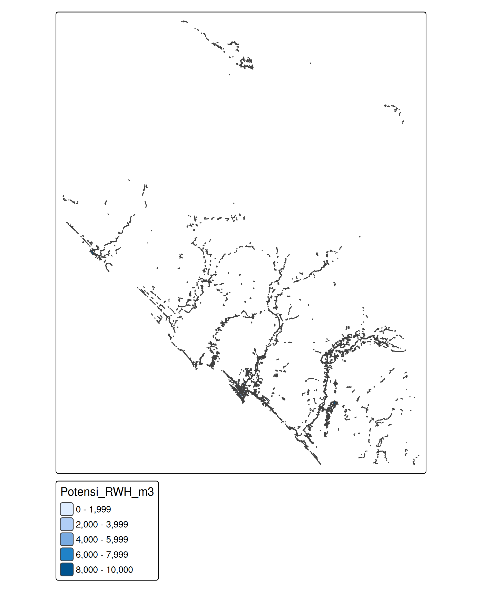

# Analisis Spasial Potensi Rainwater Harvesting - Aceh Barat

Proyek ini adalah analisis spasial untuk memetakan potensi **Rainwater Harvesting (Pemanenan Air Hujan)** pada kawasan permukiman di Kabupaten Aceh Barat. Analisis ini menggunakan data curah hujan dari NASA POWER dan data spasial permukiman.

## 1. Tujuan Analisis
* Menghitung potensi volume air hujan berdasarkan luas atap bangunan dan rata-rata curah hujan tahunan.
* Menyediakan visualisasi peta yang memudahkan identifikasi kawasan dengan potensi RWH tertinggi.

## 2. Visualisasi Hasil


## 3. Cara Menjalankan
1. Pastikan R dan RStudio sudah terinstal di komputer kamu.
2. Download atau *clone* repositori ini.
3. Buka file `analisis_pemanenan_air_hujan.R` menggunakan RStudio.
4. Klik tombol **Source** (atau tekan `Ctrl+Shift+S`) di RStudio untuk menjalankan seluruh skrip.
5. Skrip akan memproses data dan menyimpan hasilnya secara otomatis ke dalam folder `outputRWH/` berupa file `.png` (peta statis) dan `.html` (peta interaktif).

## 4. Peta Interaktif
Selain peta statis, Anda juga dapat mengakses **Peta Interaktif** melalui browser untuk eksplorasi lebih mendalam (seperti *zoom* dan *identify* data):

[👉 Klik di sini untuk membuka Peta Interaktif](https://rijaleffendi2002-maker.github.io/analisis-rwh-aceh-barat/outputRWH/peta_potensi_rwh_aceh_barat_interaktif.html)

## 5. Struktur Folder
```text
├── analisis_pemanenan_air_hujan.R  # Skrip utama analisis
├── README.md                       # Dokumentasi proyek
└── outputRWH/                      # Folder hasil komputasi
    ├── peta_potensi_air_hujan.png  # Peta hasil analisis
    └── sessionInfo.txt             # Catatan versi R dan paket


